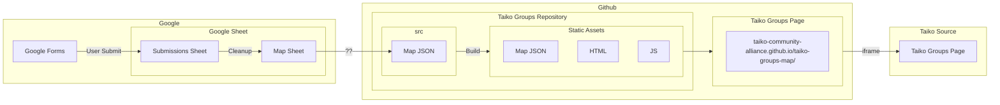

# Taiko Groups Map
This project hosts the code and data used in the Taiko Groups map as seen on https://www.taikosource.org/.
It uses data collected by the Taiko Community Alliance from user submisssions and various sources.

## Libraries Used
 - [Leaflet.js](https://github.com/Leaflet/Leaflet)
 - [Leaflet Map Clustering](https://github.com/Leaflet/Leaflet.markercluster)
 - [Leaflet SidePanel](https://github.com/cyclingbyte/Leaflet.SidePanel)
 - [Leaflet RepeatedMarkers](https://gitlab.com/IvanSanchez/Leaflet.RepeatedMarkers)

## Build Workflow and Hosting
The following flow chart outlines how the Taiko Groups Map is generated, built, and hosted on Taiko Source.

